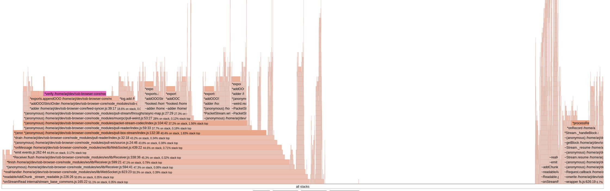

# JS benchmark

A collection of different benchmark for the JS stack

## full sync

Browser core doing [full sync](https://github.com/arj03/ssb-browser-core/blob/master/scripts/full-sync.js) from scratch:

full feeds: 5.144s
partial feeds: 1:07.991 (m:ss.mmm)
query: 430.823sm

Clearly ssb-validate is one of the top offenders.
